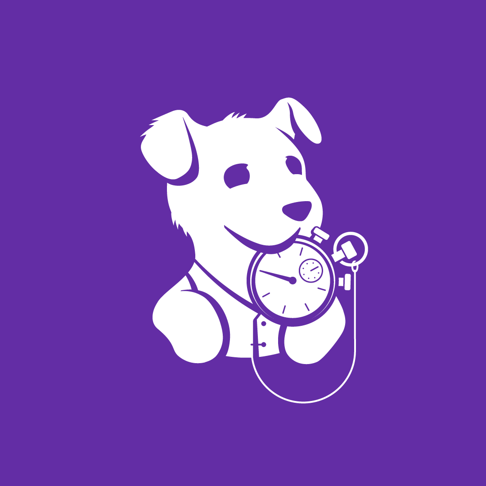

# PHP Profiler



The profiler is implemented in Rust. To see the currently required Rust
version, refer to the [rust-toolchain.toml](rust-toolchain.toml) file. The profiler
requires PHP 7.1+, and does not support debug builds.

## Time Profiling

The profiler sets the Zend VM interrupt flag approximately every 10ms. The
Zend Engine will handle this interrupt at the next place it's safe to do so.
Notably, this waits until an internal function like `curl_exec` has been
popped off the stack. This information is quite valuable, so this extension
installs a `zend_execute_internal` hook which also checks the interrupt and
handles the profiler's portion of the interrupt, but doesn't clear the
interrupt. This allows interrupts to continue as normal for other extensions
while allowing the profiler to see the internal function.

When the interrupt handler runs, it collects the wall-time and cpu-time since
the last run. This makes the cpu-time biased towards functions which do I/O,
but on the other hand it is very cheap to gather. This can be fixed by having
separate timers for wall-time and cpu-time, but if not done carefully this can
accidentally double the amount of latency and cpu overhead the profiler has on
the process.

## Compiling

The command `cargo build` will run the [build.rs](build.rs) script, which is
how it adapts to various PHP versions. The
[bindgen](https://crates.io/crates/bindgen) crate is used to generate Rust
bindings to the Zend Engine. Although bindgen is pretty good, there are things
like complex macro expansions which it doesn't understand, so there is a bit of
C code to do things that Rust/bindgen isn't good at.

The [src/bindings/mod.rs](src/bindings/mod.rs) file manually defines certain
structs and function definitions instead of letting bindgen handle it. This
allows us to gloss over minor differences in const-correctness in the engine
definitions across versions, as well as provide more idiomatic types in some
cases where they are ABI compatible.

## Testing

The command `cargo test` will run the tests on the profiler. To also run the
stack walking test run `cargo test --features stack_walking_tests`.

To see if the profiler is recognised by your PHP version as an extension you
may run `/path/to/php -d extension=target/debug/libdatadog_php_profiling.so
--ri datadog-profiling` and check the output.

The following command will help you run the [PHPT tests](tests/phpt):

```sh
/path/to/php /path/to/run-tests.php -d extension=target/release/libdatadog_php_profiling.so -n tests/phpt
```

Be aware that the PHPT tests will fail with the debug version of the profiler,
if you haven't already, build the release version with `cargo build --release`.
Also the `run-tests.php` version has to match the PHP version used to run the
tests.

## Benchmarks

Benchmarks are implemented using
[criterion](https://github.com/bheisler/criterion.rs). In order to execute them
you need to change the `crate-type` in the `Cargo.toml` from `cdylib` to `rlib`
(or add it):

```diff
 [lib]
-crate-type = ["cdylib"]
+crate-type = ["rlib"]
 bench = false # disables cargo build in libtest bench
```

After this change you can execute the benchmarks using:

```sh
cargo bench --features stack_walking_tests
```

Note: the `--features stack_walking_tests` is necessary as some code in the
`php_ffi.c` is only compiled for tests and benchmarks and compilation is guarded
behind a feature flag.

## Troubleshooting

#### ld: symbol(s) not found for architecture arm64

If your linker is not finding certain symbols, you might be missing your
architecture in the [.cargo/config.toml](.cargo/config.toml) file. You should be able to
fix this problem by adding your target as shown by `rustc -vV`.

#### Can't find `libdatadog_php_profiling.so` on MacOS

On MacOS the file extension being used is `.dylib` and not `.so`. The correct
file path should be `target/release/libdatadog_php_profiling.dylib`.
