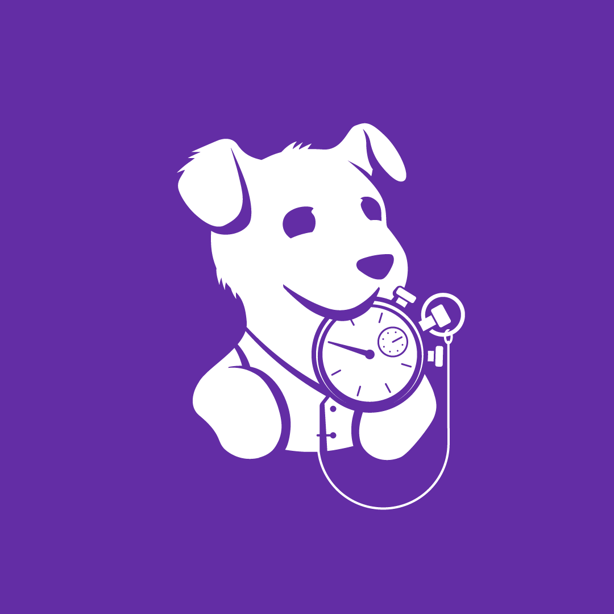

# PHP Profiler



The profiler is implemented in Rust. To see the currently required Rust
version, refer to the [rust-toolchain.toml](rust-toolchain.toml) file. The profiler
requires PHP 7.1+ and supports both release and debug PHP builds.

## Time Profiling

The profiler sets the Zend VM interrupt flag approximately every 10ms. The
Zend Engine will handle this interrupt at the next place it's safe to do so.
Notably, this waits until an internal function like `curl_exec` has been
popped off the stack. This information is quite valuable, so this extension
installs a `zend_execute_internal` hook which also checks the interrupt and
handles the profiler's portion of the interrupt, but doesn't clear the
interrupt. This allows interrupts to continue as normal for other extensions
while allowing the profiler to see the internal function.

When the interrupt handler runs, it collects the wall-time and cpu-time since
the last run. This makes the cpu-time biased towards functions which do I/O,
but on the other hand it is very cheap to gather. This can be fixed by having
separate timers for wall-time and cpu-time, but if not done carefully this can
accidentally double the amount of latency and cpu overhead the profiler has on
the process.

## Compiling

From the repository root, run `phpize`, then select one profiler build:

- Standalone `datadog-profiling.so`: `./configure --disable-ddtrace-tracer --enable-ddtrace-profiling`
- Combined tracer and profiler `ddtrace.so`: `./configure --enable-ddtrace-tracer --enable-ddtrace-profiling`

Run `make` after configuring. Both modes invoke the root Cargo package and its
profiler build helper, which is how the profiler adapts to various PHP versions.
Standalone profiling defaults on when its module is explicitly loaded; combined
`ddtrace.so` defaults profiling off and is enabled with `DD_PROFILING_ENABLED=1`.
A direct `cargo build` does not produce a supported PHP extension artifact.
The [bindgen](https://crates.io/crates/bindgen) crate is used to generate Rust
bindings to the Zend Engine. Although bindgen is pretty good, there are things
like complex macro expansions which it doesn't understand, so there is a bit of
C code to do things that Rust/bindgen isn't good at.

The [src/bindings/mod.rs](src/bindings/mod.rs) file manually defines certain
structs and function definitions instead of letting bindgen handle it. This
allows us to gloss over minor differences in const-correctness in the engine
definitions across versions, as well as provide more idiomatic types in some
cases where they are ABI compatible.

## Testing

From the repository root, Rust tests can be run directly when the selected PHP
toolchain is supplied explicitly:

```sh
DDTRACE_PHP_INCLUDES="$(php-config --includes)" \
cargo test --no-default-features --features profiling,test
```

To also run the stack walking tests, add the `stack_walking_tests` feature.

To inspect a standalone profiler, run
`/path/to/php -d extension=modules/datadog-profiling.so --ri datadog-profiling`.
For a combined build, load `modules/ddtrace.so` and inspect `--ri ddtrace`; it
registers only the `ddtrace` module and Zend extension identities.

The following command will help you run the [PHPT tests](tests/phpt):

```sh
/path/to/php /path/to/run-tests.php -d extension=modules/datadog-profiling.so -n profiling/tests/phpt
```

For profiler-focused testing of a combined artifact, disable the other runtime
products while leaving common configuration active:

```sh
DD_TRACE_ENABLED=0 \
DD_INSTRUMENTATION_TELEMETRY_ENABLED=0 \
DD_REMOTE_CONFIG_ENABLED=0 \
/path/to/php /path/to/run-tests.php -d extension=modules/ddtrace.so -n profiling/tests/phpt
```

The `run-tests.php` version has to match the PHP version used to run the tests.

## Benchmarks

Benchmarks are implemented using
[criterion](https://github.com/bheisler/criterion.rs). In order to execute them
execute them from the repository root using:

```sh
DDTRACE_PHP_INCLUDES="$(php-config --includes)" \
cargo bench --no-default-features --features profiling,test,stack_walking_tests
```

Note: the `--features stack_walking_tests` is necessary as some code in the
`php_ffi.c` is only compiled for tests and benchmarks and compilation is guarded
behind a feature flag.

## Troubleshooting

#### Can't find the profiler library on macOS

Only the phpize/configure/Make output is a supported loadable extension. A
standalone build produces `modules/datadog-profiling.so`; a combined build
produces `modules/ddtrace.so`. Do not load or copy Cargo's intermediate cdylib
from the target directory.
