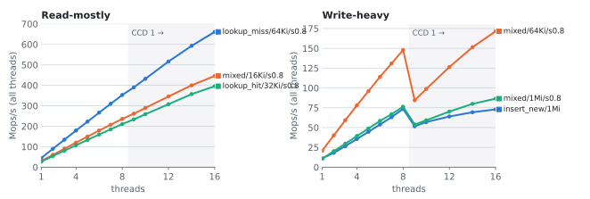
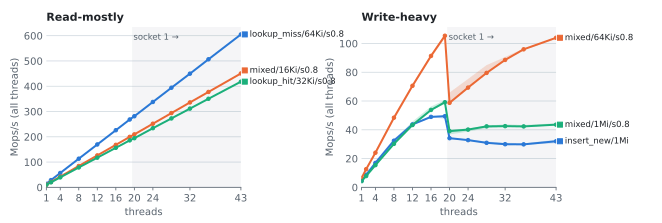
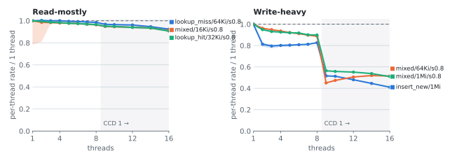
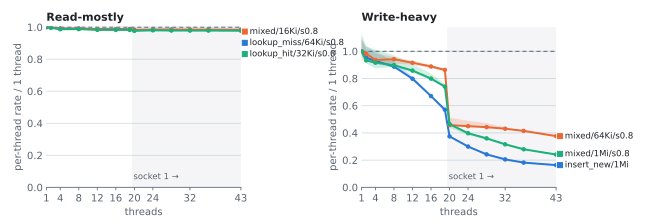
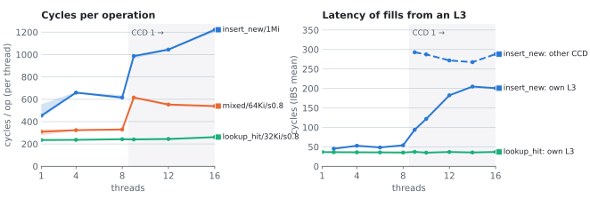
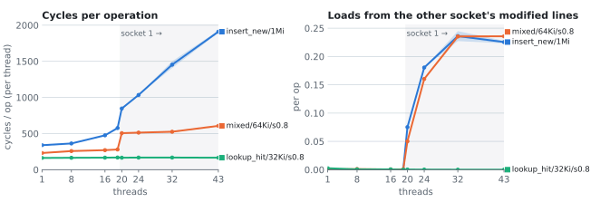
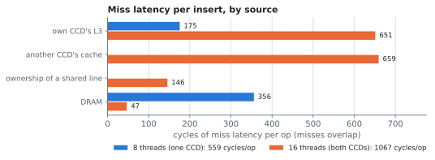
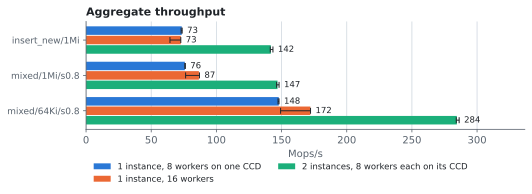

# shm_gen_cache

A fixed-size cache of byte keys to byte values that lives in one shared
memory mapping and is used concurrently, without locks, by the threads of
several processes (typically processes `fork()`ed from the parent that
created the mapping). Memory use is fixed when the cache is created, and
old entries are dropped a whole generation at a time instead of one by one.

The caller supplies a 64-bit hash with every key; the cache uses it to
find candidates and always confirms a hit by comparing the full key.

## How it works

### Generations

The mapping holds a header, one slot per participant, and three *arenas*.
Each arena is a complete hash table: an open-addressing index of
`bucket_count` 8-byte entries plus a record area from which records are
allocated by bumping an offset.

A shared 64-bit epoch `e` gives the arenas their roles:

| arena | role |
|---|---|
| `e % 3` | *current* generation: all inserts go here |
| `(e - 1) % 3` | *previous* generation: read-only, still served |
| `(e - 2) % 3` | idle: the next one to be reused |

When the current arena fills up, a *rotation* advances the epoch: the current
arena becomes the previous one, the previous one is discarded, and the idle one
is reused as the new current arena. An entry therefore lives for two generations
unless it is used: a lookup that hits in the previous generation copies
(*promotes*) the entry into the current one, so entries that keep being read
survive rotations indefinitely. The result is an approximation of LRU eviction
with no per-entry bookkeeping.

### Lookup

A lookup writes nothing to shared memory (except when it promotes). It probes
the current arena and then the previous one. The probe starts at the key's home
bucket and scans the index in groups of eight entries; an entry is a candidate
only if its epoch stamp and a few bits of the hash match, so most non-matching
entries are rejected without touching their records. For a candidate, the lookup
compares the key, copies the value into the caller's buffer, and then re-reads
the global epoch: if the arena was reused while it was copying (there were two
rotations in the interim), it discards the copy and retries. A lookup never
waits for a writer.

### Insert

An insert announces which epoch it is writing into by *pinning* its
participant slot to that epoch, reserves space in the current arena's
record area, writes the record, publishes the index entry (replacing an
older entry for the same key), and unpins. Space is usually taken from a
chunk the participant reserved earlier, so most inserts need no shared
read-modify-write on the arena.

### Rotation

An insert (or a promotion) triggers a rotation when the current arena
reaches its occupancy target (`max_occupancy` entries), its record area is
exhausted, or its index is full. Occupancy is either an exact shared counter
or, for large tables, a per-participant statistical estimate that avoids a
contended counter. One participant becomes the rotation owner, seals the
current arena against new reservations, waits until no participant is still
pinned to the arena about to be reused, resets that arena, and publishes the
next epoch. Reuse does not clear the old index or records: every index entry
and record carries a 32-bit epoch stamp, and stale ones are rejected because
their stamp no longer matches.

### Participants and crashed processes

Every thread that uses the cache registers a participant slot first. The
slot holds the participant's pin and, on Linux and Windows, its identity
(thread ID and start time). A process can die in the middle of an insert,
leaving its slot pinned forever. So a rotation that has waited a bounded
time on a pinned slot checks whether its owner is still alive and, if not,
recovers the slot (*slot reaping*) and carries on. No operation waits
indefinitely: waits are bounded and end in a timeout status.

### Rotation waits

An insert or promotion may have to wait for another participant's rotation,
and a rotation owner for old pins to clear. These waits are bounded at 5 ms
(`src/wait.rs`): they spin briefly, then sleep until the awaited cache line
is written where the CPU supports it, then, on Linux, block on a futex. When
the budget runs out, a dead participant is taken over or reaped; a live one
makes the operation fail with `ROTATION_OWNER_TIMEOUT` or
`ARENA_REUSE_TIMEOUT`, and the caller can retry.

Terminology: *slot reaping* recovers a dead participant's slot; *arena
reuse* is rotation reinitialising an old arena.

### Limits

- 64-bit hosts only. Dead participants are detected only on Linux and
  Windows; other platforms never reap a slot and are meant for development.
- Epoch stamps are 32 bits wide: an entry, or a lookup in progress, must not
  survive until its stamp comes round again after 2^32 rotations (epoch ABA
  problem).
- All processes sharing a mapping must use the same shared layout
  (currently version 11); different versions are not compatible.

## Use from C

The C API is eight functions, declared in [`shm_gen_cache.h`](shm_gen_cache.h)
(generated by cbindgen from `src/ffi.rs`, committed):

| function | does |
|---|---|
| `ddog_sgc_cache_new` | validates a `ddog_sgc_Config`, maps the cache `MAP_SHARED \| MAP_ANONYMOUS` (advised `MADV_HUGEPAGE` on Linux; process-private `VirtualAlloc` memory on Windows), initialises it |
| `ddog_sgc_cache_mapping_size` | bytes a cache with a given `ddog_sgc_Config` needs |
| `ddog_sgc_cache_init_in` | validates the config, the alignment (128 bytes on aarch64, 64 elsewhere) and the size of caller-provided zero-filled memory, initialises the cache in it |
| `ddog_sgc_cache_free` | frees the handle; unmaps this process's view if `ddog_sgc_cache_new` mapped it |
| `ddog_sgc_participant_register` | claims a participant slot for the calling thread |
| `ddog_sgc_participant_unregister` | releases it |
| `ddog_sgc_lookup` | copies a hit into a word-aligned buffer, promotes previous-generation hits |
| `ddog_sgc_insert` | inserts or replaces |

`DDOG_SGC_STATUS_OK` is 0 and `MISS` is 1; the other statuses are errors,
and their numbers are stable. Zero in `record_area_size`, `max_occupancy` or
`reservation_chunk_size` selects that field's default (documented on
`ddog_sgc_Config`). Occupancy is estimated (no shared counter) when the
table is large enough for the estimate to be reliable (e.g. 8192 buckets at
a 0.7 target, but not 4096), unless `always_exact_occupancy` is set.

Huge pages: lookups touch random buckets and records across the whole
mapping, and 2 MiB pages made cache-resident workloads up to ~12% faster in
the benchmark. `ddog_sgc_cache_new` therefore advises the mapping
`MADV_HUGEPAGE`, but shared anonymous memory only gets transparent huge
pages when `/sys/kernel/mm/transparent_hugepage/shmem_enabled` is `advise`,
`always` or `within_size`. With `never` (a common default) the advice has no
effect. Check `ShmemPmdMapped` in `/proc/PID/smaps` for the backed amount.

Fork: children inherit the mapping and the cache handle; a participant
handle inherited across `fork()` is refused (`INVALID_ARGUMENT`) and
`unregister` on it only frees it, so a child registers its own. On Linux all
processes must share PID and time namespaces with `/proc` mounted (the
liveness backend identifies participants by kernel TID and start time, and
synchronises with dead ones through `membarrier(MEMBARRIER_CMD_GLOBAL)`).
Windows has no `fork()`, and the C API cannot attach to a cache another
process initialised: through it, a Windows cache is shared only by the
threads of one process. (Rust code can attach to a section mapped by each
process with `Cache::from_raw`; the processes must then run in the same
server silo and be able to open each other's threads, normally: as the same
user.) The liveness backend identifies participants by thread ID and
creation time.
Other platforms use a no-op backend (nothing is ever reaped): development
only.

Regenerate the header from the repository root (also part of `make
generate_cbindgen`):

```sh
cbindgen --crate shm_gen_cache --config shm_gen_cache/cbindgen.toml \
  --output shm_gen_cache/shm_gen_cache.h
```

The static library is `target/<profile>/libshm_gen_cache.a` (`cargo build
-p shm_gen_cache --profile tracer-release`); on Linux link it with `-lm -ldl
-lpthread` (`cargo rustc -p shm_gen_cache --crate-type staticlib --
--print native-static-libs` prints the full list). The crate is not yet a
dependency of `datadog-php`; integrating it into `ddtrace.so` means adding
it as an rlib dependency and re-exporting `shm_gen_cache::ffi`.

## Use from Rust

```rust
use shm_gen_cache::{Cache, Config, Exact, RuntimeParams, output_buffer};

let derived = Config { bucket_count: 256, ..Config::DEFAULT }.resolve()?;
let params = RuntimeParams::<Exact>::new(&derived)?;
// `mem`: derived.mapping_size() zeroed bytes, cache-line aligned.
let cache = unsafe { Cache::initialize(mem, derived.mapping_size(), params)? };
let mut lock = cache.register_participant()?; // !Send: this thread only
lock.insert(hash, b"key", b"value")?;
let mut out = output_buffer!(64);
assert_eq!(lock.lookup(hash, b"key", &mut out)?, Some(&b"value"[..]));
```

`static_config!` defines a zero-sized compile-time configuration instead
(the C++ non-type template parameter): every parameter folds to a constant,
and `<T as StaticParams>::Storage` is matching zeroed static storage. The
verification suite uses it.

## Performance

Measured with the crate's benchmark (`benches/sgc_bench.rs`, see
[benches/README.md](benches/README.md)) at commit `6dbaab2dde`, built with
the `tracer-release` profile. Each worker is pinned to its own physical core
and has its own participant; the cache is backed by transparent huge pages.
A run's value for a scenario is the median of 7 repetitions of 250,000
operations per thread; the lines are the medians over runs and the bands
span the lowest to the highest run.

| | Ryzen 9 9950X | AWS m5.metal |
|---|---|---|
| Cores used | 16, one per core (SMT siblings idle) | 43 dedicated: 19 on socket 0, 24 on socket 1 |
| Cache topology | 2 CCDs of 8 cores, 32 MiB L3 each, one NUMA node | 2 × Xeon Platinum 8259CL: 2 sockets of 24 cores, 35.75 MiB L3 each, one NUMA node per socket |
| Clock | boost on, `powersave` governor | pinned at 2.5 GHz, turbo off |
| Runs | 7 | 5 (Benchmarking Platform, `tweaked-metal` runner) |

Read-mostly scenarios scale almost linearly: at 16 threads the 9950X keeps
91-92% of the single-thread rate per thread, and the m5.metal 98% at 43
threads. Write-heavy scenarios scale only while all workers share one L3
cache: the aggregate throughput drops when the 9th worker lands on the
9950X's second CCD, and when the 20th lands on the m5.metal's second
socket. On the 9950X insert_new/1Mi falls from 73 to 52 Mops/s and
mixed/64Ki/s0.8 from 148 to 84; on the m5.metal from 49.5 to 34 and from 105
to 59. Adding cores on the second CCD or socket recovers some of that, but
insert_new/1Mi never gets back to its peak.

<picture>
  <source media="(prefers-color-scheme: dark)" srcset="docs/performance/9950x-throughput-dark.svg">
  
</picture>
<picture>
  <source media="(prefers-color-scheme: dark)" srcset="docs/performance/m5metal-throughput-dark.svg">
  
</picture>

Scaling efficiency is the per-thread rate relative to one thread (1 is
perfect scaling):

<picture>
  <source media="(prefers-color-scheme: dark)" srcset="docs/performance/9950x-scaling-dark.svg">
  
</picture>
<picture>
  <source media="(prefers-color-scheme: dark)" srcset="docs/performance/m5metal-scaling-dark.svg">
  
</picture>

### Why write scaling collapses once workers span two L3 caches

An insert writes two kinds of lines that other workers write too. It
publishes its index entry with a compare-and-swap on the index slot;
buckets are random and a 64-byte line holds 8 slots, so the line was
usually last written by another worker. And it reads the arena's control
word, which every worker bumps with a `fetch_add` whenever it claims a new
chunk of the arena. While all workers share one L3, such a line comes from
there. Once they run on both CCDs or sockets, the line, or exclusive
ownership of it, increasingly has to come from the other L3. Lookups only
read lines that nobody writes, so those stay shared in both L3 caches.

The hardware counters (timed region only) bear this out. An insert in
insert_new/1Mi executes the same instructions at every thread count (598-629
on the 9950X, 419-433 on the m5.metal), but its cycles jump when the
workers cross to the second CCD or socket, while lookup_hit/32Ki/s0.8 stays
flat. On the 9950X, AMD IBS samples show that all L3-level fills of an
insert get slower: from its own L3 they take about 50 cycles while one CCD
is in use, but over 200 at 14-16 threads, and from the other CCD 270-290.
On the m5.metal each extra cross-socket load comes with 2,600-4,500 extra
cycles, far more than one remote access takes, so there the lines are
presumably contended too.

<picture>
  <source media="(prefers-color-scheme: dark)" srcset="docs/performance/9950x-counters-dark.svg">
  
</picture>
<picture>
  <source media="(prefers-color-scheme: dark)" srcset="docs/performance/m5metal-counters-dark.svg">
  
</picture>

The IBS samples of insert_new/1Mi at 16 threads also tell which lines
these are. Most fills from the other CCD are the compare-and-swaps of
`table_put` (`src/arena/put.rs`), at about 225 cycles each. The slow fills
from the own L3 are mostly the arena's control word in `reserve`
(`src/cache/store.rs`): its plain load takes about 700 cycles on average and
its `fetch_add` 600-850, while the index lines, when they do come from the
own L3, take about 80. A line that both CCDs keep writing is slow to get
even where the own L3 is the one serving it.

A second CCD also adds memory traffic and L3 capacity, so an experiment on
the 9950X isolates the sharing. With 8 workers, insert_new/1Mi runs on one
CCD, split 4+4 across both, or on one CCD.

Weighting each source's fills per insert by their mean IBS latency shows
where the time goes (an upper bound per source, since misses overlap). The
second CCD's L3 removes almost all DRAM reads, but slower hits in the own
L3, fills from the other CCD, and ownership requests more than take their
place. The ownership requests are compare-and-swaps whose line the plain
load just before had already fetched; IBS labels them as served by DRAM,
but they take under 200 cycles, against about 590 for a real DRAM read on
this machine.

<picture>
  <source media="(prefers-color-scheme: dark)" srcset="docs/performance/9950x-fills-dark.svg">
  
</picture>

### Conclusion: one instance per CCD for write-heavy use

Write-heavy use scales as long as an instance's lines stay within one L3.
So where inserts are frequent, one shm_gen_cache instance per CCD (per
socket on a multi-socket machine), each used only by workers running on
that CCD, should scale where a single shared instance does not. On the
9950X, two such instances, each with 8 workers pinned to its CCD and run as
two benchmark processes at the same time, delivered together 1.95 times the
throughput of one instance with 16 workers in insert_new/1Mi, almost exactly
twice what 8 workers on one CCD reach alone, and 1.65-1.70 times in the
mixed scenarios (median of 3 rounds):

<picture>
  <source media="(prefers-color-scheme: dark)" srcset="docs/performance/9950x-per-ccd-dark.svg">
  
</picture>

The split has costs this benchmark does not show, since each of its
instances had the full configured size and saw its own key stream at the
same hit rate as the shared one. In real use, a hot key is cached once per
CCD, so it misses, and has to be computed and inserted, once in each; and
for the same total memory each instance is half as large. Read-mostly use
already scales with one instance and would only lose hits by splitting it.

The figures and their data are in `docs/performance/`: `data/*.json` holds
every run's value and the counters per operation, and `plot.py` aggregates
raw results into it and draws the figures (`uv run plot.py --help`);
`plot.py fills-table data/9950x-fills.json` prints the fill sources as a
table, with every source and also mixed/64Ki/s0.8 and lookup_hit/32Ki/s0.8.
`data/9950x-l3lat.json` has the IBS fill counts and latencies per thread
count, `data/9950x-l3lat-instructions-t16.txt` the instructions behind the
fills at 16 threads, and `data/9950x-sharing.json` and
`data/9950x-per-ccd.json` the two experiments. The m5.metal job is
`gustavo.lopes/shm-gen-cache-rust-scaling` in
DataDog/benchmarking-platform.

## Build variants

The library is `#![no_std]`. Features: `ffi` (default; the C API, mmap and
the Linux and Windows backends; implies `std`), `std` (process abort, the
estimator's `f64::sqrt`/`log2`, which `core` lacks on the pinned toolchain,
and, outside Linux, the scheduler yield of rotation waits; on OSes other
than Linux and Apple also their clock, so required there), `verify` (the
verification build, below, which also exposes `shm_gen_cache::test_access`).
The staticlib needs `ffi`.

Without default features the library is `no_std`, which suits only an rlib
(the GenMC bitcode builds): Cargo builds every crate type of the package,
and a `no_std` staticlib has no panic handler, so `cargo check
--no-default-features` fails. Check that build as an rlib instead, as CI
does:

```sh
cargo rustc -p shm_gen_cache --no-default-features --crate-type rlib
```

A `no_std` build compiles only on Linux and Apple targets, whose steady
clock the rotation waits read with `clock_gettime`. Elsewhere, Windows
included, they take it from `std::time::Instant`, and the build stops with a
`compile_error!` without `std`. Every Windows build uses `ffi` (and so
`std`) anyway.

`verify` must never be enabled for production artifacts. `cargo build -p
shm_gen_cache` (with any profile) leaves it off, but a build of the whole
workspace (`--workspace`, or `cargo build` at the root) unifies features
with the GenMC suite's package, which enables it.

Compile-time variants. The cfgs are passed with `--cfg` by the GenMC bitcode
builds only:

| feature / cfg | effect |
|---|---|
| feature `verify` | verification build: `production_assert!` off, `test_access` and the `GetPid` test hooks enabled |
| `sgc_genmc` (bitcode target) | requires feature `verify`: `fatal()` panics (the runner turns panics into assertion failures), `cpu_relax` is empty, initialisation fills use relaxed atomic word stores instead of `memset` |
| `sgc_genmc_short_waits` | rotation waits give up after 2 spin polls; their clock reads, monitored sleeps, futex calls and yields are compiled out |
| `sgc_genmc_futex_model` | instead of `sgc_genmc_short_waits`, for the GenMC programs that check wakes: rotation waits block at once, without spin polls or a budget, in a model of the futex (`wait::futex_model`) whose waiters only a wake ends; clock reads, monitored sleeps, futex calls and yields are compiled out as above |

`production_assert!` is checked only in debug builds without `verify`.  When
off, its condition is not evaluated.

## Tests

```sh
cargo test -p shm_gen_cache            # smoke tests (Rust and C API), fork test
cargo test -p shm_gen_cache --release
```

These are smoke tests only; the protocol is checked by the GenMC suite under
`verification/` (`cargo nextest run -p shm_gen_cache_verification`; see
[verification/README.md](verification/README.md)).
